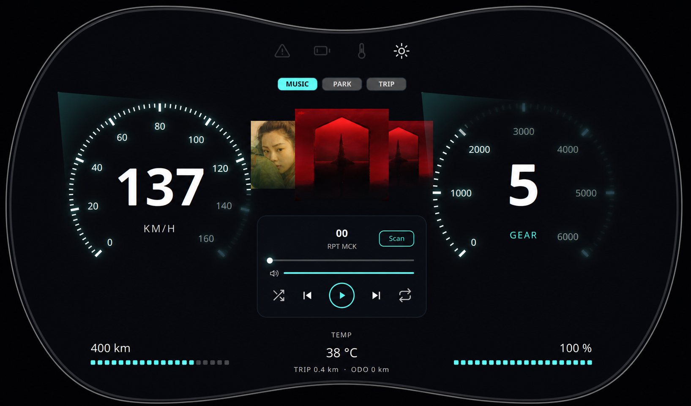

# QtStmAutomotiveSimulator

> A Qt 6 automotive dashboard that visualizes STM32 UART telemetry and stays usable through an in-process simulator fallback.



## What it demonstrates

- C++17 + Qt Quick/QML dashboard built with a strict MVVM boundary.
- UART telemetry pipeline for STM32F103C8T6, with parser, mapper, watchdog, and automatic simulator fallback.
- Driver-focused interactions: Music, rear Parking Assist, Trip Computer, day/night theme, and vehicle-style CenterHub navigation.
- Passive QML: presentation only; application state and interaction logic remain in C++.

## Quick Start

```bash
cmake -S . -B build
cmake --build build -j2
./build/QtStmAutomotiveSimulator
```

## Verification

Four deterministic CTest targets cover ViewModels, music playback, serial telemetry, and Parking Assist.

```bash
ctest --test-dir build --output-on-failure
```

## Status

The software telemetry pipeline and simulator fallback are tested. Physical STM32 firmware, USB-TTL wiring, and unplug/replug behavior still require field validation.

## Learn more

- [Architecture and MVVM boundaries](docs/architecture.md)
- [STM32 and UART integration](docs/hardware_integration.md)
- [Testing strategy](docs/testing_strategy.md)
- [Current project status](docs/tasks_board.md)
