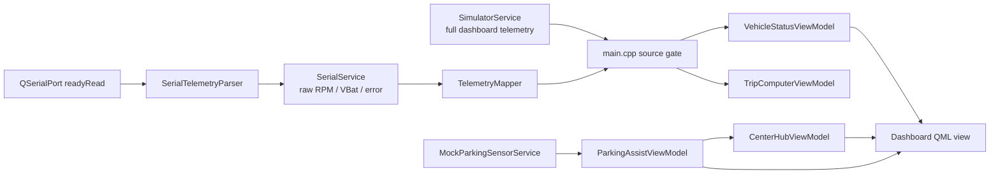

# QtStmAutomotiveSimulator

> **AI Context**: Repository overview for the C++17/Qt 6.8 Neon Cyberpunk dashboard, its verified software interfaces, deterministic tests, and pending hardware field validation.

A Qt Quick automotive dashboard with one Car layout, C++-owned state, a music player, one-sensor rear Parking Assist, and STM32F103C8T6 telemetry over UART. The application falls back to an in-process simulator whenever serial telemetry is unavailable.


## Features

- Strict MVVM: focused C++ ViewModels are exposed to passive QML.
- Zero-JS policy: stateful interaction and domain logic live in C++.
- One stable Car layout with fixed double-arch gauges and CenterHub.
- Day/night themes with a stable cyan/teal accent palette.
- Tick-lit double-arch gauges, glass panels, and telltales.
- Car CenterHub with persistent Music and Parking Assist pages.
- Mock-first rear Parking Assist with one ultrasonic distance sample; Music stays visible for clear/caution, the panel auto-selects only for a live critical sample below 30 cm, and CenterHub navigation remains C++-owned.
- C++ `QMediaPlayer`, C++-owned scrubber state, and worker-thread music scanning.
- Qt Multimedia disables optional FFmpeg video hardware probing at startup and defers `QMediaPlayer` construction until playback, so a missing VDPAU/NVIDIA backend cannot prevent the audio dashboard from launching; this does not modify host drivers.
- Implemented serial parser, telemetry mapper, watchdog, reconnect, and simulator fallback.
- Four deterministic Qt Test/CTest targets.

> [!NOTE]
> The serial software pipeline and no-hardware fallback transitions are automated and verified. Live STM32 firmware, USB-TTL wiring, unplug/replug behavior, and motor control still need field validation.

## Architecture

`src/main.cpp` owns both services and the retained context ViewModels:

| QML context | Responsibility |
|---|---|
| `VehicleStatus` | Speed, RPM, gear, warning, battery, range, temperature |
| `MusicViewModel` | Library model, playback, progress, and scrubber |
| `ThemeController` | Day/night state |
| `TripComputer` | Odometer, trip, average speed, formatted displays |
| `ParkingAssist` | One rear distance, reverse state, hysteresis-stabilized proximity/health state, and C++-formatted display |
| `CenterHubController` | C++-owned Music and Parking Assist page selection |

The transport contracts are deliberately different:



`SimulatorService::telemetryUpdated(...)` supplies all dashboard fields. `SerialService::rawTelemetryUpdated(...)` supplies only parsed wire values. `TelemetryMapper::fromSerial(...)` derives dashboard fields outside the transport, and `main.cpp` updates the shared ViewModel surface. QML never selects a telemetry source.

Serial parsing runs in the GUI thread from `QSerialPort::readyRead` and performs no blocking waits. Only `MusicScanner` uses a worker thread for `QDirIterator`.

See [architecture.md](docs/architecture.md) for ownership, threading, MVVM, and Zero-JavaScript rules.

## Project Layout

```text
CyberDash-STM32/
├── AGENTS.md
├── CMakeLists.txt
├── README.md
├── src/
│   ├── main.cpp
│   ├── services/
│   │   ├── MockScenarioEngine.{h,cpp}
│   │   ├── MockParkingSensorService.{h,cpp}
│   │   ├── MusicScanner.{h,cpp}
│   │   ├── SerialService.{h,cpp}
│   │   ├── SerialTelemetryParser.{h,cpp}
│   │   ├── SimulatorService.{h,cpp}
│   │   └── TelemetryMapper.{h,cpp}
│   └── viewmodels/
│       ├── MusicPlayerViewModel.{h,cpp}
│       ├── ParkingAssistViewModel.{h,cpp}
│       ├── CenterHubViewModel.{h,cpp}
│       ├── ThemeViewModel.{h,cpp}
│       ├── TripComputerViewModel.{h,cpp}
│       └── VehicleStatusViewModel.{h,cpp}
├── qml/
│   ├── Main.qml
│   ├── Theme.qml
│   ├── components/
│   │   ├── CenterHub.qml
│   │   ├── EnergyBlocks.qml
│   │   ├── GlassPanel.qml
│   │   ├── GlowingText.qml
│   │   ├── MusicPlayer.qml
│   │   ├── NeonIcon.qml
│   │   ├── NeonIconButton.qml
│   │   ├── NeonTickGauge.qml
│   │   └── ParkingAssistView.qml
│   └── screens/
│       └── DashboardScreen.qml
├── resources/
│   ├── icons/
│   └── media/
│       └── dashboard-preview.png
├── tests/
│   ├── CMakeLists.txt
│   ├── main.cpp
│   ├── tst_music_playback.cpp
│   ├── tst_parking_assist.cpp
│   └── tst_serial_pipeline.cpp
├── docs/
│   ├── DOCUMENTATION_STANDARDS.md
│   ├── architecture.md
│   ├── hardware_integration.md
│   ├── journal.md
│   ├── music_player_design.md
│   ├── tasks_board.md
│   ├── testing_strategy.md
│   └── ui_ux_guidelines.md
└── .agents/
    ├── skills/
    └── workflows/
```

## Requirements

- Qt 6.8 or newer with Core, Gui, Qml, Quick, Test, SerialPort, and Multimedia.
- CMake 3.16 or newer.
- A C++17 compiler.
- Optional for field validation: STM32F103C8T6 and USB-TTL adapter.

## Build and Run

```bash
cmake -S . -B build
cmake --build build -j2
./build/QtStmAutomotiveSimulator
```

The host currently constructs `SerialService` for `/dev/ttyUSB0`. If the open fails, the initial disconnected state starts `SimulatorService`. A successful open remains logically disconnected until a valid telemetry frame arrives.

## Testing

CTest registers exactly four targets:

| Target | Actual responsibilities |
|---|---|
| `tst_viewmodels` | Vehicle telemetry properties; day/night theme; trip computer; Car-only application graph |
| `tst_music_playback` | Playback state controls and C++ scrubber clamping/drag state; CTest supplies `QT_QPA_PLATFORM=offscreen` |
| `tst_serial_pipeline` | Parser, checksum, buffering, mapper, and no-hardware connection transitions |
| `tst_parking_assist` | Thresholds/hysteresis, sensor health, invalid/stale input, deterministic mock progression without automatic STOP, formatting, notifications, manual CenterHub swipe/page selection, and STOP-only handoff |

Run the deterministic baseline:

```bash
cmake -S . -B build
cmake --build build -j2
ctest --test-dir build --output-on-failure
```

Scan QML for forbidden patterns, then manually classify every match. Comment-only matches are non-executable; any executable match fails the policy:

```bash
rg -n '\bMath\.|on[A-Z][A-Za-z]+\s*:\s*\{|\b(function|if|for|while|switch|var|let|const)\b' qml -g '*.qml'
```

For QML changes, also run the repository `qt-qml-review` workflow. A display-independent smoke command is:

```bash
QT_QPA_PLATFORM=offscreen timeout 8s ./build/QtStmAutomotiveSimulator
```

See [testing_strategy.md](docs/testing_strategy.md) for evidence and troubleshooting rules.

## UART Protocol

The implemented receive format is newline-delimited ASCII:

```text
TEL,<rpm>,<battery-voltage>,<error-code>;<checksum>\n
```

The checksum is:

```cpp
(rpm + int(vbat) + error) & 0xFF
```

Valid examples:

```text
TEL,118,11.8,0;129\n
TEL,3000,11.8,0;195\n
```

`SerialTelemetryParser` retains partial frames and clears the buffer if it grows beyond 4096 bytes. `SerialService` uses a 500 ms valid-frame watchdog and a 2000 ms reconnect timer. A resource error or timeout closes the port, clears parser state, publishes disconnected once, and starts the simulator; a valid frame after reconnect publishes connected and stops the simulator.

The implemented outbound emergency helper sends:

```text
STOP;\n
```

The current host does not implement a checksummed outbound `SET` protocol. See [hardware_integration.md](docs/hardware_integration.md) before changing the wire contract.

## UI System

The current canonical reference is the preview at the top of this README. `qml/Theme.qml` centralizes palette, geometry, typography, and duration tokens.

- Day/night theme state comes from `ThemeController`.
- `DashboardScreen` has one stable Car layout.
- The Car CenterHub contains the persistent Music player page.
- While reverse is active, `CenterHubController` keeps Music visible until a live distance is below 30 cm, then selects the passive Parking Assist panel; a critical live sample always keeps the warning selected. MusicPlayer remains alive and resumes afterward. The panel shows only a centered ultrasonic zone, distance, health, and OEM-style status text — never a fake camera image.
- Every `MultiEffect` captures a sibling source; recursive `source: parent` is forbidden.

See [ui_ux_guidelines.md](docs/ui_ux_guidelines.md).

## Roadmap and Status

Detailed phase status is maintained in [tasks_board.md](docs/tasks_board.md).

| Phase | Scope | Status |
|---|---|---|
| 0 | Project scaffold | Complete |
| 1 | MVVM core and testing | Complete |
| 2 | QML shell and UI guidelines | Complete |
| 3 | Hardware simulation | Complete |
| 4 | STM32 software integration | Implemented; field validation pending |
| 5 | Holographic dashboard | Complete |
| 6 | Advanced mock engine | Complete |
| 7 | Dynamic hardware fallback | Complete |
| 8 | UI/UX aesthetic refinement | Complete |
| 9 | Music player UI | Complete |
| 10 | Architecture audit and debt cleanup | Complete with stale claims corrected |
| 11 | UI standardization and layout refactor | Complete |
| 12 | Functional telltale bar | Complete |
| 13 | Day/night theme | Complete |
| 15 | Trip computer | Complete |
| 16 | CenterHub introduction | Complete |
| 17 | Pre-Feature Baseline Repair | Software implementation and full verification complete; physical field validation pending |
| 18 | Rear Parking Assist | Mock implementation and verification complete; STM32 ultrasonic adapter pending |
| 19 | Parking Assist UI + bezel clearance | OEM panel complete; compact baseline geometry retained |
| 20 | STOP-gated Parking Assist polish | Music retained for clear/caution; live critical auto-page, health states, hysteresis, and mock override seam complete |
| 21 | CenterHub manual swipe | Horizontal Music/Distance Warning drag implemented with critical safety override and C++ gesture state |
| 22 | Qt Creator VDPAU runtime investigation | Process-local diagnostics and FFmpeg probing mitigation documented; host GPU configuration unchanged |
| 23 | Lazy multimedia backend startup | `QMediaPlayer` startup deferred until first playback request; offscreen smoke no longer reports VDPAU |
| 24 | CenterHub pointer-handler compile fix | Removed invalid `DragHandler` anchors assignment |
| 25 | Code review and section close | Parking STOP recovery regression fixed; review evidence and follow-up backlog recorded |
| Current | Car dashboard baseline | One stable Car layout; retained graph and verification contract are maintained in [tasks_board.md](docs/tasks_board.md) |

Physical STM32/USB-TTL field validation remains pending.

## Contribution Rules

- Use C++17 and keep QML passive.
- Write focused tests first for behavior changes.
- Preserve `SimulatorService`/`SerialService` source-swap invariance at the ViewModel boundary.
- Complete configure, build, CTest, Zero-JS scan, and QML review checks before marking work done.
- Commit only after verification; push only with an appropriate repository state and user authorization.

## License

No `LICENSE` file is currently committed. Treat the repository as all rights reserved until the owner adds one.
