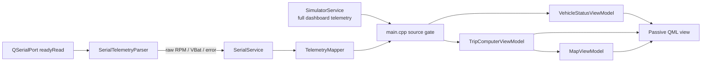

# 🏗️ Architecture: MVVM, Services, and Zero JavaScript

> **AI Context**: Active specification of ownership and data flow between the C++17 services, seven context ViewModels, and passive QML view.

## 1. Ownership and Lifetime

`main.cpp` owns all application services and the seven ViewModels exposed through the `QQmlContext`. They remain alive for the duration of `app.exec()`.

| Context property | C++ owner/type | Concern |
|---|---|---|
| `VehicleStatus` | `VehicleStatusViewModel` | Dashboard telemetry presented to QML |
| `MusicViewModel` | `MusicPlayerViewModel` | Library model, playback, and scrubber interaction |
| `ThemeController` | `ThemeViewModel` | Day/night theme and boot choreography |
| `VehicleMode` | `VehicleModeViewModel` | Car, Bike, and Scooter state |
| `DriveMode` | `DriveModeViewModel` | NORMAL, SPORT, and ECO state |
| `TripComputer` | `TripComputerViewModel` | Odometer, trip, and average speed |
| `MapModel` | `MapViewModel` | Route progress derived from odometer distance |

`SimulatorService`, `SerialService`, and `QElapsedTimer` are also stack-owned in `main.cpp`. QObject parent ownership covers each service's internal timers and serial port.

## 2. Telemetry Contracts

The two transports intentionally do not expose identical signals:

- `SimulatorService::telemetryUpdated(...)` emits a complete dashboard record: speed, RPM, gear, warning, battery, range, and temperature.
- `SerialService::rawTelemetryUpdated(...)` emits only parsed wire fields: RPM, battery voltage, and error code.
- `TelemetryMapper::fromSerial(...)` is the transport-independent conversion boundary. `main.cpp` maps raw serial data, then updates `VehicleStatusViewModel`.



The `isHardwareConnected` gate ensures simulator updates are accepted only while serial is disconnected and serial updates only after a valid frame establishes the connection. A source switch restarts the trip clock so disconnected time is not integrated as distance.

## 3. Parser and Mapper Boundaries

`SerialTelemetryParser` owns byte buffering, newline framing, field conversion, and checksum validation. It accepts only a complete `TEL` line and clears an oversized buffer after it grows beyond 4096 bytes. In protocol notation, its checksum is exactly:

```cpp
(rpm + int(vbat) + error) & 0xFF
```

A valid example is:

```text
TEL,118,11.8,0;129\n
```

`TelemetryMapper` does not read bytes or manage connection state. It deterministically derives dashboard speed, gear, warning, battery, range, and temperature from a parsed raw record. This serial derivation no longer lives in `SerialService`.

## 4. Threading Model

`QSerialPort`, `SerialTelemetryParser`, `TelemetryMapper`, and ViewModel updates run on the GUI thread. `readyRead` work is bounded and non-blocking: read available bytes, split complete lines, validate, emit.

Only media directory scanning runs on a worker thread. `MusicScanner` uses the worker-object pattern with `QThread` and `QDirIterator`; results return to `MusicPlayerViewModel` through queued signals.

> [!WARNING]
> Do not move a QObject with a parent to another thread, block the GUI thread waiting for serial input, or access QML-owned state from the music scanner worker.

## 5. Zero-JavaScript Rule

QML is a passive declarative view. Imperative functions, control flow, local mutation, and block-form event handlers are forbidden. Property bindings, ternary presentation bindings, declarative `States`/`Transitions`, and one direct `Q_INVOKABLE` call from a handler are allowed.

```qml
MouseArea {
    onPressed: MusicViewModel.beginScrub(mouseX, width)
    onPositionChanged: MusicViewModel.updateScrub(mouseX, width)
    onReleased: MusicViewModel.endScrub()
}
```

Scrubber drag state and normalization are C++ properties and invokables; QML does not calculate or retain scrub state.

## 6. MVVM Standard

Every ViewModel inherits `QObject`, declares `Q_OBJECT`, exposes observable state through `Q_PROPERTY`, and emits its `NOTIFY` signal only when the effective value changes. New behavior must have a C++ home before QML binds to it.

## Troubleshooting

- **Simulator never starts:** confirm `SerialService::startService()` publishes the initial disconnected state and that the `connectionStatusChanged(false)` connection is installed first.
- **Valid serial bytes do not update the UI:** verify the newline and checksum, then confirm `rawTelemetryUpdated` reaches `TelemetryMapper` while `isHardwareConnected` is true.
- **Partial data survives a disconnect:** all stop, resource-error, and watchdog paths must call `SerialTelemetryParser::clear()`.
- **UI freezes during scanning:** confirm only `MusicScanner` performs `QDirIterator` work and that it remains on its worker thread.
- **QML contains interaction math:** move it into a ViewModel invokable/property and leave only a direct call or binding in QML.
