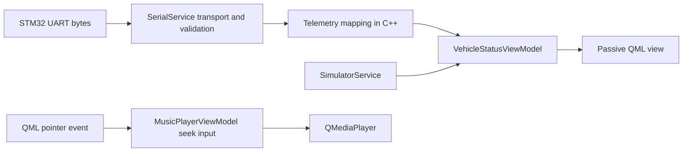

# Design Spec: Pre-Feature Baseline Repair

> **AI Context**: Defines the bounded repair required to make runtime behavior, tests, and project documentation agree before new feature development begins.

**Date**: 2026-07-27

## 1. Goal

Restore a trustworthy development baseline by fixing the confirmed Zero-JavaScript, serial fallback, telemetry-boundary, headless-test, and documentation inconsistencies without introducing a new product feature.

## 2. Scope

### In Scope

- Move the music scrubber's imperative pointer handling out of QML.
- Make serial resource errors transition the application to simulator fallback deterministically.
- Move derived dashboard telemetry out of `SerialService`.
- Add automated coverage for serial framing, checksum rejection, partial input, disconnect, and watchdog behavior.
- Make multimedia tests deterministic in headless environments.
- Synchronize `AGENTS.md`, README, core guides, task status, and journal with verified behavior.
- Repair or replace the missing design-inspiration asset reference.
- Verify Markdown structure against `docs/DOCUMENTATION_STANDARDS.md`.

### Out of Scope

- New dashboard features or vehicle modes.
- Redesigning the UART wire protocol.
- STM32 firmware changes.
- Replacing Qt Multimedia or the existing MVVM architecture.
- Broad visual redesign of the dashboard.

## 3. Architecture

### 3.1 Zero-JavaScript Scrubber

QML remains a passive input surface. Pointer events call a single C++ `Q_INVOKABLE` method with the pointer position and available width. `MusicPlayerViewModel` performs clamping and converts the pointer position to a seek ratio. QML must not mutate local drag state or call JavaScript helpers such as `Math.max`.

The existing visual binding remains declarative. If a drag-state property is required for preventing playback-position updates during interaction, it must be owned by C++ and exposed through `Q_PROPERTY`.

### 3.2 Serial Service Boundary

`SerialService` owns only serial transport concerns:

- Port lifecycle.
- Newline-delimited buffering.
- Frame syntax and checksum validation.
- Watchdog and reconnect timers.
- Emission of validated raw telemetry.

Dashboard derivations such as speed, gear, warning state, battery percentage, range, and temperature do not belong in the serial transport. A C++ telemetry mapping boundary converts the validated STM32 fields into the existing `VehicleStatusViewModel` contract. The smallest implementation that preserves the current QML surface is preferred; no QML service-awareness is introduced.

### 3.3 Connection State Machine

The serial connection state has two externally meaningful states:

- **Disconnected/stale**: simulator runs.
- **Receiving valid telemetry**: simulator stops and serial telemetry owns the dashboard.

Startup open failure, resource error, and watchdog expiry all converge on the same idempotent disconnected transition. A valid checksummed telemetry frame converges on the connected transition. Reconnect attempts do not claim connectivity until a valid frame is received.

### 3.4 Testability

Serial parsing and state transitions must be exercisable without physical UART hardware. Transport input is injected through a narrow test seam or extracted parser, while production `QSerialPort::readyRead` continues to use the same path.

Multimedia unit tests must not depend on an accessible display server or real audio daemon. CTest supplies the required Qt platform/audio environment, or the ViewModel accepts a minimal test-safe media dependency. The selected solution must preserve production playback behavior.

## 4. Data Flow

Only one telemetry source is accepted by `main.cpp` at a time. `connectionStatusChanged` controls the source switch, and QML remains unchanged between serial and simulator operation.

## 5. Error Handling

- Oversized serial buffers are cleared without accepting a partial frame.
- Malformed frames, invalid numeric fields, and invalid checksums are ignored and do not mark hardware connected.
- Resource errors emit the disconnected transition exactly once per state change and start reconnect attempts.
- Watchdog expiry emits stale telemetry only through the active source path and returns control to the simulator.
- Reconnect open success starts the watchdog but does not stop the simulator until a valid frame arrives.
- Seek input with zero or negative width is a no-op; positions outside the track are clamped.

## 6. Testing Strategy

TDD is required for every behavior change.

Automated coverage must include:

- Scrubber position-to-ratio conversion, clamping, and zero-width input.
- Valid UART frame acceptance.
- Invalid checksum rejection.
- Partial frame accumulation.
- Oversized buffer recovery.
- Resource-error disconnected transition.
- Watchdog disconnected transition.
- Reconnect does not imply valid telemetry.
- Existing ViewModel and music behavior.

Final verification must run:

1. Zero-JavaScript QML scan.
2. CMake configure and full build.
3. CTest in a documented headless environment.
4. QML lint or the repository QML review workflow.
5. A bounded offscreen smoke launch with log inspection.

## 7. Documentation Synchronization

The following documents become consistent with verified code:

- `AGENTS.md`: tool-neutral target wording, C++17, three vehicle modes, implemented hardware status, valid Golden Checks, and correct inspiration path.
- `README.md`: current tree, ViewModels, tests, phases, UART examples, and headless test instructions.
- `docs/architecture.md`: actual ViewModels, service routing, ownership, thread affinity, and fallback state machine.
- `docs/hardware_integration.md`: checksum algorithm, complete frames, timers, raw/derived field ownership, and troubleshooting.
- `docs/testing_strategy.md`: actual suites, serial coverage, headless multimedia setup, QML checks, and troubleshooting.
- `docs/ui_ux_guidelines.md`: current themes, drive accents, vehicle modes, center hub, transition and MultiEffect rules, and valid inspiration image.
- `docs/tasks_board.md`: correct historical wording and a new baseline-repair phase whose completion is based on fresh verification.
- `docs/journal.md`: rationale and observed root causes.
- `docs/DOCUMENTATION_STANDARDS.md`: explicit exception or required context format for historical spec/plan artifacts.

Historical plans and specs remain immutable records except for metadata needed to identify them as historical artifacts.

## 8. Success Criteria

- No imperative JavaScript block, local state mutation, or JavaScript utility call remains in `.qml`.
- Serial resource errors and watchdog expiry reliably activate simulator fallback.
- `SerialService` no longer fabricates dashboard-specific fields.
- Serial parser and connection behavior have repeatable hardware-free tests.
- All configured tests complete without a display server or audio daemon.
- Core Markdown documents contain no known contradiction with the verified repository.
- The missing inspiration reference is resolved.
- Build, tests, QML checks, and smoke launch have fresh recorded evidence.

