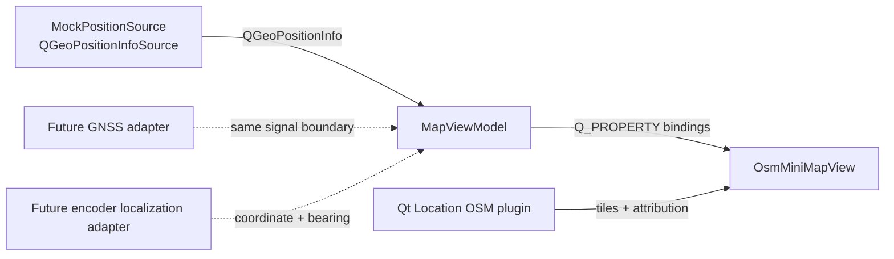

# Design Spec: OSM Follow Mini-Map

> **AI Context**: Approved Phase 20 OpenStreetMap viewport with deterministic GPS-like mock motion now and a replaceable hardware position-source boundary later.
> **Date**: 2026-07-28
> **Status**: Implemented and verified in Phase 20
> **Phase**: 20

## 1. Understanding Summary

- Show a rectangular mini-map that matches the dashboard's center-panel geometry rather than a circular watch face.
- Use Qt Location's `osm` plugin to display a real interactive OpenStreetMap viewport.
- Keep the map north-up. The marker rotates to the C++-provided bearing so it remains parallel to the active road segment.
- Follow mode keeps the marker centered. User pan or zoom temporarily enters explore mode; a four-second idle timeout restores the default zoom and recenters on the latest position.
- Begin with deterministic prerecorded GPS-like mock samples following real coordinates. Do not require public network access in automated tests.
- Preserve a source boundary that can later accept GNSS samples directly or encoder/dead-reckoning output after an appropriate localization adapter.

## 2. Scope and Non-Goals

The first release includes OSM tiles, a moving marker, north-up presentation, pan, zoom, automatic follow restoration, an unobtrusive follow/explore label, and visible provider attribution.

The first release does not include destination search, turn-by-turn navigation, public routing calls, route downloads, offline tile bundles, GPS hardware firmware, or encoder map matching. Encoder counts alone are not absolute map coordinates and must never be presented as GNSS without an explicit localization stage.

## 3. Research Constraints

Qt 6.11.1 `QtLocation`, `QtPositioning`, and the `qtgeoservices_osm` plugin are installed in the development environment. Qt's OSM plugin supports a distinct application user agent, network/disk caches, custom providers, offline directories, and a `NoPrefetching` policy.

The public OpenStreetMap raster service requires visible attribution, an identifying User-Agent, cache compliance, and normal human-driven viewport access. It prohibits bulk downloading, pre-seeding, and offline bundles from `tile.openstreetmap.org`. The application therefore uses `NoPrefetching`, leaves copyrights visible, and treats the default public provider as development/demo infrastructure rather than a production SLA.

Primary references:

- [Qt Location OSM plugin](https://doc.qt.io/qt-6.11/location-plugin-osm.html)
- [Qt Location Map](https://doc.qt.io/qt-6/qml-qtlocation-map.html)
- [Qt Location MapView](https://doc.qt.io/qt-6/qml-qtlocation-mapview.html)
- [Qt Location MapQuickItem](https://doc.qt.io/qt-6/qml-qtlocation-mapquickitem.html)
- [OpenStreetMap tile usage policy](https://operations.osmfoundation.org/policies/tiles/)

## 4. Architecture

`QGeoPositionInfoSource` is the standard Qt position-source boundary. `MockPositionSource` subclasses it and is the only implementation in Phase 20. It publishes `QGeoPositionInfo` with a coordinate and `Direction` attribute, owns a fixed OSM/OSRM-extracted driving polyline (Pasteur → Đồng Khởi → Công trường Lam Sơn → Pasteur), segment progress, speed, and its timer, and keeps deterministic `advance(elapsedMs)` available to tests.

`MapViewModel` consumes a replaceable, non-owning `QGeoPositionInfoSource` pointer and accepts its valid `lastKnownPosition()` immediately. It validates samples and owns current position, normalized bearing, viewport center, follow/explore state, zoom bounds, Web-Mercator pan conversion, and the four-second follow-resume timer. QML forwards raw drag, wheel, and pinch deltas through direct invokable calls; the ViewModel performs all calculations and restarts the resume timer while the user continues exploring. Wheel input falls back to a pixel-only delta for trackpads.

`OsmMiniMapView.qml` is a passive rectangular view. It declares the OSM `Plugin`, a raw `Map`, declarative viewport bindings, direct-call pointer handlers, and a `MapQuickItem` marker. The stock `MapView.qml` assembly is not copied because its built-in gestures contain imperative JavaScript. The project view contains no route calculations, timers, mutation, or imperative control flow.

## 5. Position and Bearing Contract

Each source update contains:

| Field | Contract |
|---|---|
| Coordinate | Valid latitude/longitude accepted by `QGeoCoordinate` |
| Bearing | Finite degrees normalized by C++ into `[0, 360)` |
| Timestamp | Valid timestamp supplied by the position source |

The mock route is a closed list of coordinates located on mapped streets. It advances by meters, not by arbitrary latitude increments. For each segment, C++ uses `distanceTo`, `azimuthTo`, and `atDistanceAndAzimuth`; the emitted bearing is the segment azimuth. The marker therefore stays parallel to the mock path while the map remains north-up.

Invalid coordinates, non-finite bearings, and non-positive `advance()` intervals do not change published state. Route wrapping is bounded and deterministic.

## 6. Follow and Explore Behavior

- Default state: `followEnabled == true`, zoom `16.5`, map bearing `0`.
- While following, each accepted position update moves `viewportCenter` to the latest `position`.
- A drag, wheel, or pinch gesture enters explore mode and updates C++-owned viewport state.
- Explore mode leaves the viewport where the user placed it while the marker continues updating geographically.
- Every additional gesture update restarts a four-second single-shot timer.
- Timer expiry restores follow mode, recenters to the latest position, and restores zoom `16.5`.
- The marker rotation always binds to `bearingDegrees`; north-up map bearing never follows the vehicle.

## 7. UI Contract

The map occupies the second page inside the static `CenterHub` `SwipeView`, preserving `MusicPlayer` lifetime. The page uses the existing rectangular glass-panel footprint, rounded corners, dark fallback color, cyan frame, and compact page indicator.

The marker is a small cyan vector arrow with a light outline and restrained glow. It must remain legible against both bright and dark OSM tiles without covering nearby street names. A small `FOLLOW`/`EXPLORE` pill is allowed; controls, destination fields, routing banners, lane guidance, and decorative road overlays are not.

OSM copyrights remain visible and must not be covered by the status pill or page indicator.

## 8. Failure Handling

- Missing Qt Location or OSM plugin: CMake/configuration fails explicitly rather than silently substituting an unrelated renderer.
- Network/provider failure: retain the dark map background, marker state, and provider error text; dashboard telemetry and music remain functional.
- Invalid mock/hardware sample: ignore it without emitting state changes.
- Stale hardware input: future adapters own stale detection; the Phase 20 mock continues its deterministic loop.
- User interaction during a position update: viewport deviation detection wins and explore mode remains active until its idle timeout.

## 9. Testing

`tst_map_navigation` covers:

- deterministic first sample and elapsed-time progression;
- coordinate interpolation along a segment;
- emitted bearing matching `azimuthTo` for both straight and turning segments;
- route wrapping and maximum elapsed-time cap;
- invalid coordinate, non-finite bearing, and non-positive interval rejection;
- ViewModel position/bearing normalization and no-change signal behavior;
- pan, wheel, and pinch gestures entering explore mode;
- Web-Mercator pan direction, longitude wrapping, latitude clamping, and zoom clamping;
- automatic follow restoration with an injected short timeout;
- ViewModel acceptance of any source using the common position signal contract.

CTest never depends on OSM network availability. QML verification consists of project lint, module `qmllint`, Zero-JavaScript scan, and a bounded offscreen smoke run; tile delivery is a manual/runtime integration concern.
