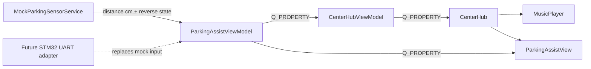

# Design Spec: Rear Parking Assist

> **AI Context**: Approved mock-first, one-sensor rear parking-assist feature for the QtStmAutomotiveSimulator. It is a data-driven automotive aid, not a camera or illustration.

## 1. Goal and Scope

Add a Car-mode rear parking-assist presentation beside the existing music experience. The initial release simulates one rear ultrasonic sensor in C++, while preserving a small, explicit boundary for future STM32 UART data.

The feature presents only when reverse is engaged. It replaces the CenterHub content while active and restores the persistent music player when reverse is no longer active. There are no QML buttons, QML timers, QML calculations, camera images, or imperative JavaScript.

The release does not implement a camera, multiple sensors, firmware changes, a new serial wire protocol, obstacle classification, or audio beeps.

## 2. User Experience

The panel follows an OEM parking-assist hierarchy, adapted to the existing neon cyberpunk theme:

- A dark glass panel uses the existing dashboard geometry and typography.
- A restrained rear-bumper silhouette sits above the measured distance; it does not depict a fake camera feed or synthetic obstacle image.
- One centered proximity zone represents the single rear ultrasonic sensor.
- `REAR CLEAR` is cyan/teal for distances above 150 cm.
- `REAR CAUTION` is amber for distances from 31 cm through 150 cm.
- `STOP` is `Theme.warningRed` for distances from 1 cm through 30 cm.
- The primary numeric reading is an integer centimetre value, for example `42 CM`.
- A stale, missing, non-finite, zero, negative, or over-range sample renders `SENSOR UNAVAILABLE`, with no retained last measurement presented as current.

The music player is not destroyed while parking assist is active. The CenterHub contains both static visual children and selects the displayed one declaratively from a C++-owned active-page property.

## 3. Architecture and Data Flow

`MockParkingSensorService` owns a bounded deterministic mock sequence and emits a distance in centimetres plus an active-reverse state. It is the only release-one data source. The sequence cycles through clear, caution, stop, and unavailable states so every visual state is observable without UI controls.

`ParkingAssistViewModel` is the feature authority. It receives sensor samples, validates their range, derives the warning level and presentation strings, and exposes read-only `Q_PROPERTY` values. It does not parse bytes or know whether a sample originated in the mock or in hardware.

`CenterHubViewModel` owns the active CenterHub page. It reacts to the parking ViewModel reverse-active state and exposes a page index to QML. When inactive, it selects Music; when active, it selects Parking Assist. It never owns sensor values.

The future STM32 adapter supplies the same high-level sample boundary after the existing serial protocol is deliberately extended and verified. The STM32F103 does not carry video. A hardware sample must include a valid rear-distance centimetre value and reverse-active state; raw ultrasonic timing is converted before reaching `ParkingAssistViewModel`.

## 4. C++ Interfaces

`ParkingAssistViewModel` provides these read-only properties:

| Property | Type | Meaning |
|---|---|---|
| `reverseActive` | `bool` | Whether rear parking presentation should be active. |
| `sensorAvailable` | `bool` | Whether the most recent sensor sample is valid and current. |
| `rearDistanceCm` | `int` | Valid measured distance in centimetres; `0` when unavailable. |
| `proximityLevel` | `enum` | `Unavailable`, `Clear`, `Caution`, or `Stop`. |
| `distanceText` | `QString` | C++-formatted integer centimetre display or `—` when unavailable. |
| `statusText` | `QString` | Exact display text for the current level. |

The ViewModel accepts C++ service input through a typed method or signal carrying `int distanceCm` and `bool reverseActive`. It accepts values from `1` through `250` cm inclusive. All other values mark the sensor unavailable. A valid sample becomes unavailable after 1,000 ms without another update while reverse remains active.

`CenterHubViewModel` exposes a read-only `activePage` integer. `0` is Music and `1` is Parking Assist. Only the C++ ViewModel selects this page.

## 5. QML Boundaries

`ParkingAssistView.qml` is passive. It binds only to `ParkingAssistViewModel` properties and Theme tokens. It has no input handlers because the release-one panel is informational.

`CenterHub.qml` keeps static `MusicPlayer` and `ParkingAssistView` instances. Its existing page container binds its page index to `CenterHubViewModel.activePage`. Music playback, scan state, and scroll position persist through the temporary parking-assist display.

New theme tokens are limited to an amber parking-assist accent and muted unavailable state. Existing cyan, warning red, dark glass, typography, spacing, and animation-duration tokens remain the primary visual system.

## 6. Safety and Failure Behavior

- An unavailable sensor never renders a distance or a false safe state.
- The unavailable state is visible only while reverse is active; leaving reverse returns CenterHub to Music immediately.
- Repeated identical sensor values do not emit redundant property notifications.
- The mock service and all ViewModels run on the GUI thread and perform bounded timer work only.
- Replacing the mock source with future UART input does not change QML or the ViewModel interface.

## 7. Testing and Verification

Add a focused `tst_parking_assist` Qt Test target before production code. It proves:

- range classification at 250, 151, 150, 31, 30, and 1 cm;
- invalid values `0`, negative, and greater than 250 cm become unavailable;
- reverse state selects and exits the parking page;
- no duplicate change signal is emitted for an effective no-op;
- a reverse-active sample becomes unavailable after the injected 1,000 ms stale interval;
- mock progression covers clear, caution, stop, and unavailable states without wall-clock dependency.

The feature then requires the project configure, full build, all CTest targets, exact Zero-JS scan, changed-QML `qt-qml-review`, and offscreen smoke run.
